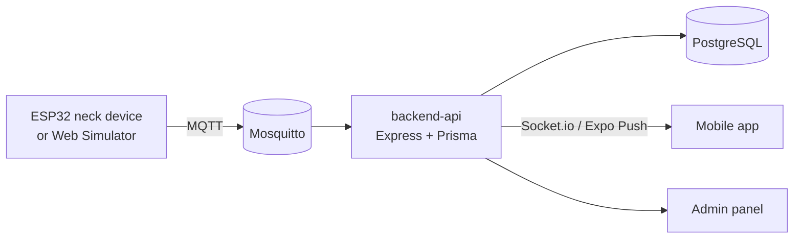

# FallHelp

[English](README.md) · [ภาษาไทย](README.th.md)

<!-- markdownlint-disable MD033 -->
<p align="center">
  
</p>
<!-- markdownlint-enable MD033 -->

[](LICENSE)
[](https://github.com/Wattanaroj2567/fallhelp/releases/latest)

**A neck-worn fall detection device with a caregiver mobile app.** The device detects falls with an IMU, attaches heart rate from a PPG ear-clip sensor, and alerts caregivers instantly. The wearer can cancel a false alarm on the device within 15 seconds.

## Try the demo

- 📱 **Android APK:** [download the latest preview build](https://github.com/Wattanaroj2567/fallhelp/releases/latest)
- 🧪 **No hardware?** The [device simulator](apps/device-simulator) sends the same MQTT messages as the real device. See the [demo guide](docs/demo/DEMO_GUIDE.md).

## Features

- 🔴 Real-time fall detection (forward, backward, side, chair falls) via MPU6050 IMU
- 💓 Heart rate at fall time via XD-58C PPG ear-clip sensor
- 🔔 Instant push and in-app alerts; caregivers **acknowledge** confirmed alerts
- 🛡️ False-alarm cancel on the device button within 15 s
- 📊 Monthly fall history and reports
- 🌐 Admin panel for device management

## Architecture


```mermaid
flowchart LR
  D["ESP32 neck device<br/>or Web Simulator"] -- MQTT --> B[(Mosquitto)]
  B --> API["backend-api<br/>Express + Prisma"]
  API --> DB[(PostgreSQL)]
  API -- "Socket.io / Expo Push" --> M[Mobile app]
  API --> A[Admin panel]
```

More detail: [project overview](docs/PROJECT_OVERVIEW.md).

<!-- markdownlint-disable MD033 -->
<details>
<summary>📸 Screenshots</summary>

| Login | Dashboard | Fall alert |
|---|---|---|
|  |  |  |

| History | Notifications | Device |
|---|---|---|
|  |  |  |

| Elder | Emergency contacts | Report |
|---|---|---|
|  |  |  |

| Register | Profile | |
|---|---|---|
|  |  | |

</details>
<!-- markdownlint-enable MD033 -->

## Tech stack

| Area | Stack |
|---|---|
| Mobile | React Native (Expo 55), NativeWind |
| Backend | Node.js, Express 5, Prisma, PostgreSQL, MQTT, Socket.io |
| Admin | React 19, Vite, TailwindCSS |
| Firmware | ESP32 (Arduino/C++), MPU6050, XD-58C |
| Tooling | Nx monorepo |

## Project structure

| Path | What |
|---|---|
| `apps/mobile` | Caregiver app (Expo) |
| `apps/backend-api` | REST API, MQTT handlers, realtime |
| `apps/admin` | Device management panel |
| `apps/device-simulator` | Web device simulator for demos |
| `firmware/esp32` | Device firmware |

## Quick start (developers)

```bash
npm install
npm run env:setup
npm run backend:db:setup
npm run dev:all
```

Full guide: [docs/DEVELOPMENT.md](docs/DEVELOPMENT.md) · Hardware: [docs/HARDWARE.md](docs/HARDWARE.md)

## License

[MIT](LICENSE) © 2026 Wattanaroj Butdee

## Acknowledgments

This project took part in the 28th National Software Contest (NSC 2026).

> โครงการ แอปพลิเคชันและอุปกรณ์ตรวจจับการหกล้มสำหรับดูแลผู้สูงอายุแบบคล้องคอ ได้รับทุนอุดหนุนการทำกิจกรรมส่งเสริมและสนับสนุนการวิจัยและนวัตกรรมจากสำนักงานการวิจัยแห่งชาติ และสำนักงานพัฒนาวิทยาศาสตร์และเทคโนโลยีแห่งชาติ
>
> This research and innovation activity is funded by National Research Council of Thailand (NRCT) and National Science and Technology Development Agency (NSTDA).
