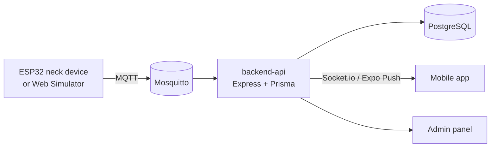

# FallHelp

[English](README.md) · [ภาษาไทย](README.th.md)

<!-- markdownlint-disable MD033 -->
<p align="center">
  
</p>
<!-- markdownlint-enable MD033 -->

[](LICENSE)
[](https://github.com/Wattanaroj2567/fallhelp/releases/latest)

**อุปกรณ์ตรวจจับการหกล้มแบบคล้องคอ คู่กับแอปมือถือสำหรับผู้ดูแล** อุปกรณ์ตรวจจับการหกล้มด้วย IMU แนบค่าชีพจรจากเซนเซอร์ PPG แบบหนีบหู แล้วแจ้งเตือนผู้ดูแลทันที ผู้สวมใส่กดยกเลิกการแจ้งเตือนผิดพลาดบนอุปกรณ์ได้ภายใน 15 วินาที

## ลองใช้งาน Demo

- 📱 **Android APK:** [ดาวน์โหลด preview build ล่าสุด](https://github.com/Wattanaroj2567/fallhelp/releases/latest)
- 🧪 **ไม่มีฮาร์ดแวร์?** [Device simulator](apps/device-simulator) ส่งข้อความ MQTT แบบเดียวกับอุปกรณ์จริง ดูขั้นตอนที่[คู่มือ Demo](docs/demo/DEMO_GUIDE.th.md)

## ฟีเจอร์

- 🔴 ตรวจจับการหกล้มแบบ real-time (ล้มไปหน้า ล้มไปหลัง ล้มด้านข้าง ล้มจากเก้าอี้) ด้วย MPU6050 IMU
- 💓 วัดชีพจรขณะล้มด้วยเซนเซอร์ PPG XD-58C แบบหนีบหู
- 🔔 แจ้งเตือนทันทีทั้ง push และในแอป ผู้ดูแลกด**รับทราบ (Acknowledge)** การแจ้งเตือนที่ยืนยันแล้ว
- 🛡️ ผู้สวมใส่กดปุ่มบนอุปกรณ์เพื่อยกเลิกการแจ้งเตือนผิดพลาดได้ภายใน 15 วินาที
- 📊 ประวัติการหกล้มและรายงานรายเดือน
- 🌐 Admin panel สำหรับจัดการอุปกรณ์

## สถาปัตยกรรม



รายละเอียดเพิ่มเติม: [ภาพรวมโปรเจกต์](docs/PROJECT_OVERVIEW.md) (ภาษาอังกฤษ)

<!-- markdownlint-disable MD033 -->
<details>
<summary>📸 ภาพหน้าจอ</summary>

<table>
  <tr>
    <td align="center" valign="top"><br /><sub>เข้าสู่ระบบ</sub></td>
    <td align="center" valign="top"><br /><sub>Dashboard</sub></td>
    <td align="center" valign="top"><br /><sub>แจ้งเตือนการหกล้ม</sub></td>
  </tr>
  <tr>
    <td align="center" valign="top"><br /><sub>รายละเอียดการหกล้ม</sub></td>
    <td align="center" valign="top"><br /><sub>ประวัติ</sub></td>
    <td align="center" valign="top"><br /><sub>รายงานรายเดือน</sub></td>
  </tr>
  <tr>
    <td align="center" valign="top"><br /><sub>จับคู่อุปกรณ์ (QR)</sub></td>
    <td align="center" valign="top"><br /><sub>อุปกรณ์</sub></td>
    <td align="center" valign="top"><br /><sub>โทรฉุกเฉิน</sub></td>
  </tr>
</table>

ภาพทุกหน้าของแอป (58 หน้า) และ admin panel: [docs/SCREENSHOTS.md](docs/SCREENSHOTS.md)

</details>
<!-- markdownlint-enable MD033 -->

## เทคโนโลยีที่ใช้

| ส่วน | เทคโนโลยี |
|---|---|
| Mobile | React Native (Expo 55), NativeWind |
| Backend | Node.js, Express 5, Prisma, PostgreSQL, MQTT, Socket.io |
| Admin | React 19, Vite, TailwindCSS |
| Firmware | ESP32 (Arduino/C++), MPU6050, XD-58C |
| Tooling | Nx monorepo |

## โครงสร้างโปรเจกต์

| Path | คืออะไร |
|---|---|
| `apps/mobile` | แอปผู้ดูแล (Expo) |
| `apps/backend-api` | REST API, MQTT handlers, realtime |
| `apps/admin` | Panel จัดการอุปกรณ์ |
| `apps/device-simulator` | Web simulator สำหรับ demo |
| `firmware/esp32` | Firmware ของอุปกรณ์ |

## เริ่มต้นสำหรับนักพัฒนา

```bash
npm install
npm run env:setup
npm run backend:db:setup
npm run dev:all
```

คู่มือฉบับเต็ม: [docs/DEVELOPMENT.md](docs/DEVELOPMENT.md) · ฮาร์ดแวร์: [docs/HARDWARE.md](docs/HARDWARE.md)

## License

[MIT](LICENSE) © 2026 Wattanaroj Butdee

## กิตติกรรมประกาศ

โครงการนี้เข้าร่วมการแข่งขันพัฒนาโปรแกรมคอมพิวเตอร์แห่งประเทศไทย ครั้งที่ 28 (NSC 2026)

> โครงการ แอปพลิเคชันและอุปกรณ์ตรวจจับการหกล้มสำหรับดูแลผู้สูงอายุแบบคล้องคอ ได้รับทุนอุดหนุนการทำกิจกรรมส่งเสริมและสนับสนุนการวิจัยและนวัตกรรมจากสำนักงานการวิจัยแห่งชาติ และสำนักงานพัฒนาวิทยาศาสตร์และเทคโนโลยีแห่งชาติ
>
> This research and innovation activity is funded by National Research Council of Thailand (NRCT) and National Science and Technology Development Agency (NSTDA).
